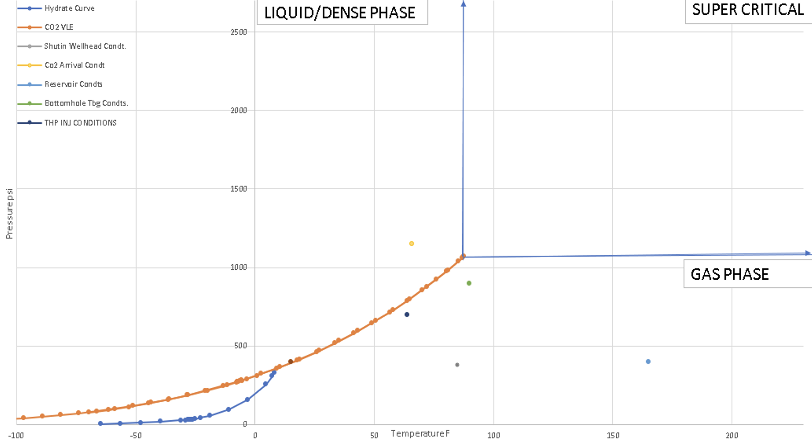

## CO2 Injection Considerations
There are several considerations during the injection of CO2 into depleted oil and gas reservoirs or into aquifer reservoirs to ensure a successful project.

## CO2 Conditions Through Facilities and Reservoir
The CO2 condition (pressure, temperature) at source, wellhead, sandface and in the reservoir over time will vary and could be in various stages i.e. liquid, gaseous or supercritical.

## Pressure and Temperature Variations During Transportation
From source to wellhead, after being transported through pipeline, CO2 may experience significant decrease in pressure but some increase in temperature. If at the wellhead choke is likely to be in a liquid state, then a heater system may need to be installed to mitigate against low wellhead temperatures.

## Heater Requirement Optimization
Phase behavior and Flow Assurance analysis can be coupled to understand the heater requirement. Heater requirements are a burden on any CCS project and if it is eliminated then the project will become more economically attractive.

#### CO2 VLE/Hydrate Curve at Various Operating Points

#### Flow Assurance Results

