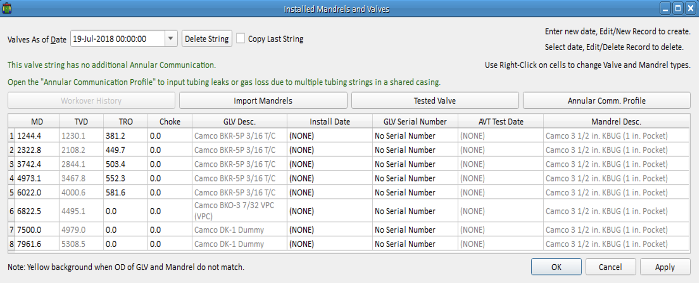
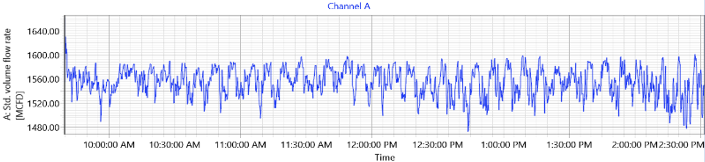
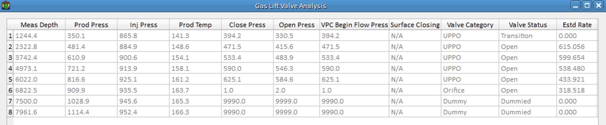
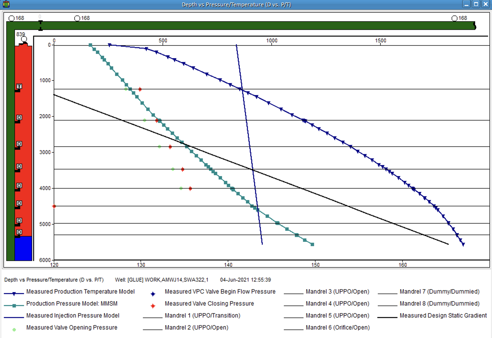
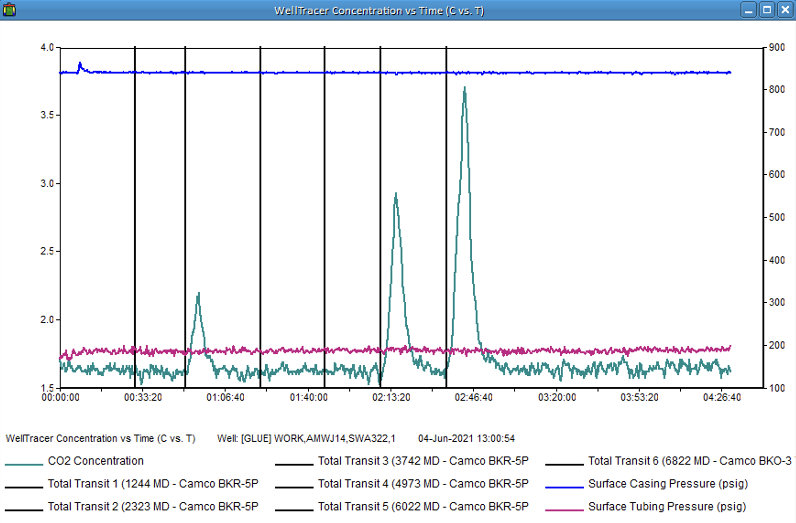
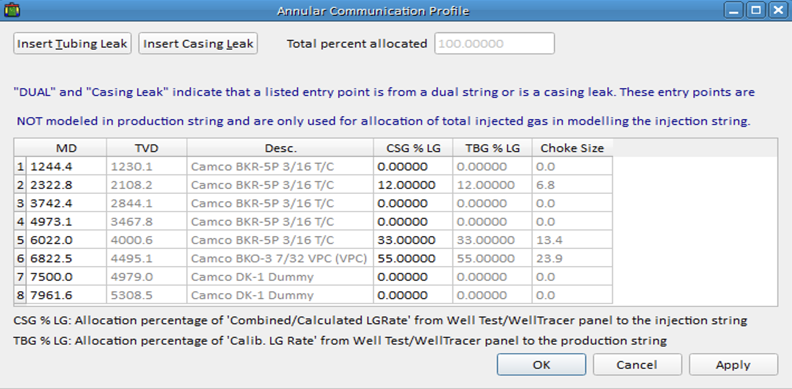

## Background
Well C was a part of an offshore campaign to determine well optimization opportunities. Unfortunately, the well testing facility has not been operational for 4 years and well monitoring has been neglected somewhat. Decline Curve Analysis was used to predict well rates. Well Diagnostic and Optimization Suite of tools were utilised to identify, troubleshoot, and provide opportunities to the client. The suite comprised of Ultrasonic Gas-lift gas measurement, Annular Fluid level detection, Co2 WellTracer Survey and WinGlue the empowering software. The campaign identified numerous oil gains and gas savings opportunities.

## Information
#### Table 1: Current Install Design

#### Figure 1: Annular Fluid Level (Below SPM 6)

#### Figure 2: Ultrasonic Gas Measurement (1555 Mscf/d)

#### Table 2: Gas lift Valve Analysis

#### Figure 3: Pressure vs Depth (All Unloading Valves Open)

#### Figure 4: WellTracer Result

#### Table 3: Gas-Lift Injection Distribution

## Summary
The Pressure vs Depth diagram indicated that all the unloading valves were open, while using the rate calculated from the Gas-lift Valve Analysis, the well would have been injecting from SPMs 2, 3 and 4. The Echometer Survey however, showed that the orifice valve was uncovered. The tell-tale data was the Welltracer Survey, from the results it demonstrated that SPM 2 was injecting, SPMs 3 & 4 were plugged and SPMs 5 and 6 were also injecting. Conventional tools on their own would have given a wrong conclusion leading to a misdiagnosis of the production optimization opportunity. The opportunity derived from the diagnostic was 290 bopd.
