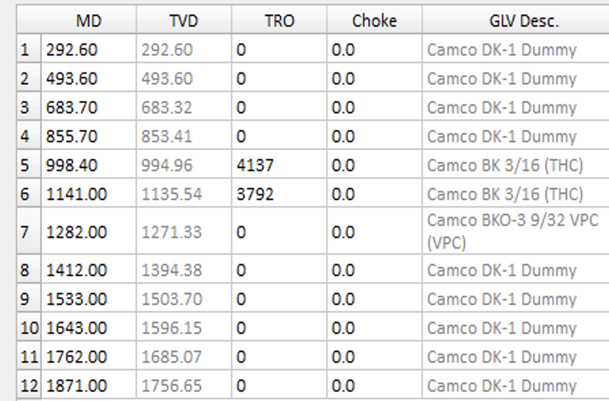
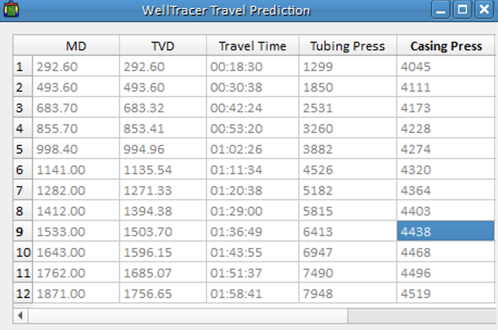
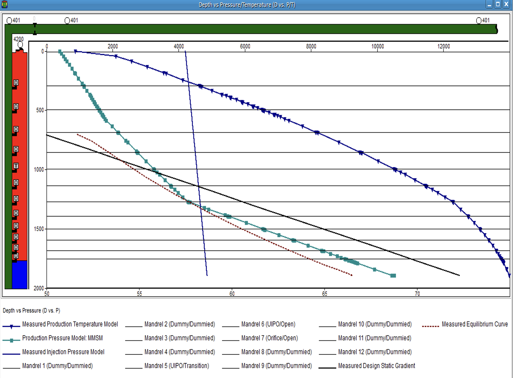
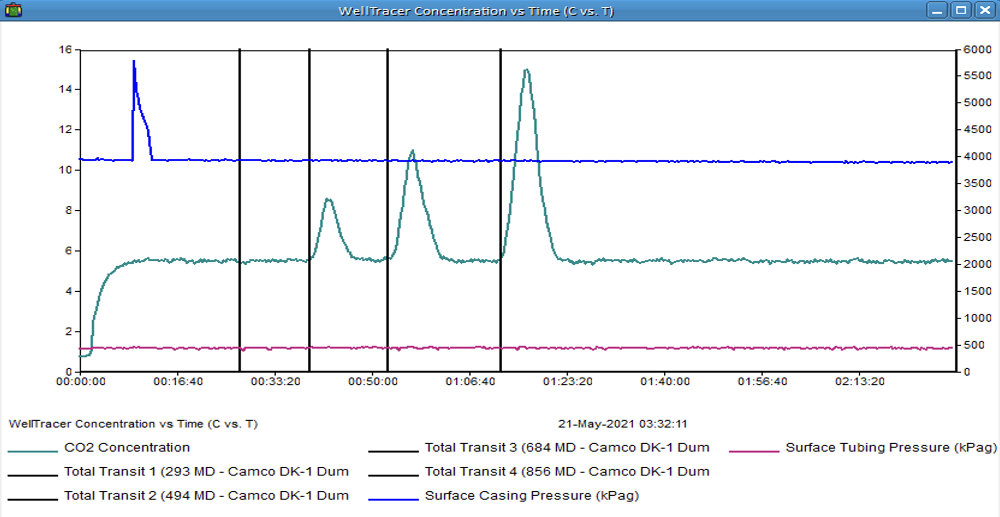
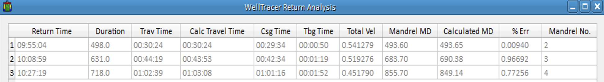
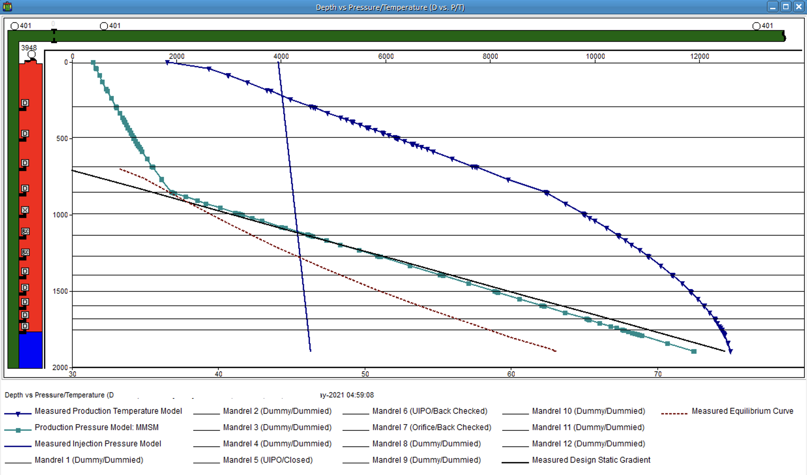

## Background
Well A was recently converted from a Production Pressure Operated (PPO) GLD to and Injection Pressure Operated (IPO) GLD, by performing a Gaslift Valve Changeout (GLVCO). Well A was tested following GLVCO, and its production was ½ of its pre-IPO conversion rate. Wireline crew was contacted to enquire about the job, and all went according to plan. Since IPO valves was relatively new to the region the consensus was PPO valves were performing better than IPO. Well Diagnostic and Optimization Suite of tools were utilised Well A.

## Information
#### Table 1: Current Install Design

#### Table 2: WellTracer Travel Time Prediction

#### Figure 1: Pressure vs Depth Designed

#### Figure 2: Well A, Observed Co2 Returns

#### Table 3: Returns Analysis (SPMs 2, 3 and 4)

#### Figure 3: Pressure vs Depth Installed

## Summary
All Three (3) IPO valves were installed in the wrong mandrels, causing the well to multipoint and to inject shallow, therefore the well performance was poorer than pre-IPO installation.