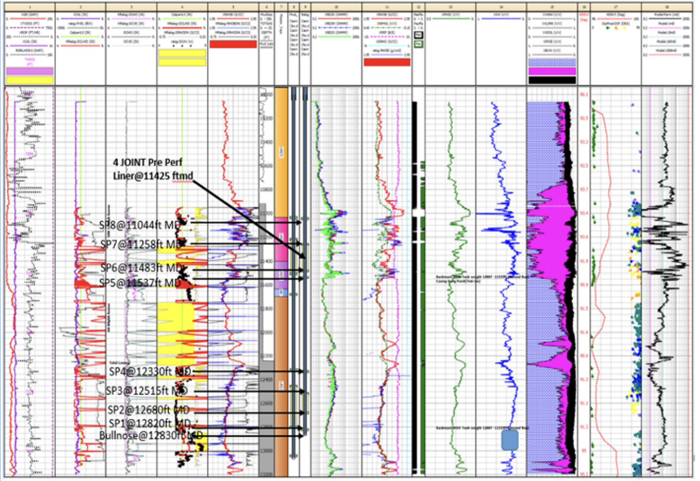
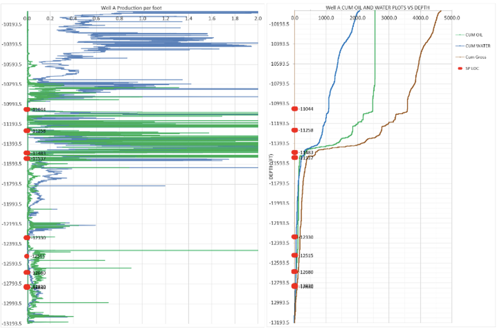
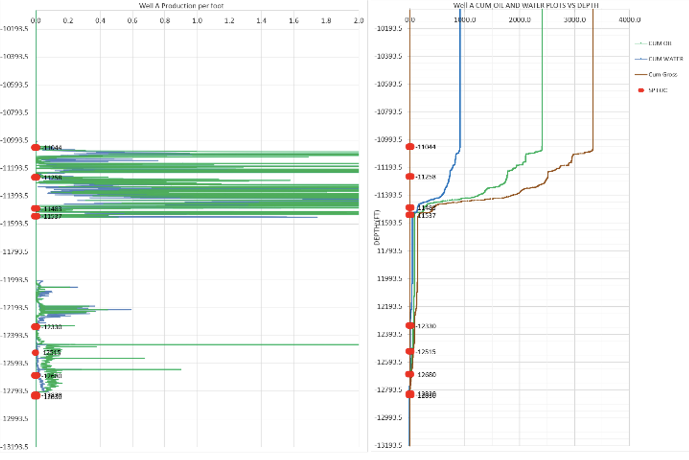

## Production
Our non-intrusive “Theoretical Production/Injection Logging Tool” can be a good way to understand the potential well performance before running downhole completion or during the production or injection phase. It can provide an insight to high productivity/injectivity zones as well as potential water entry points. The wells PI and watercut can be predicted with good accuracy.

## Validated Tool
Swell packer placement, perforations and SSD location optimisation, water and gas influx point, and downhole isolation failure detection can be achieved. The tool has been compared with 12 production logs and 5 water flow logs and the match is greater than 85%. The results from this analysis were utilised in the field with great success and provided intervention cost savings of USD 750K to 1.2 MM.

#### Open Hole Log

#### Well Log Predicted Well Performance Without Isolation

#### Predicted Well Performance With Isolation

