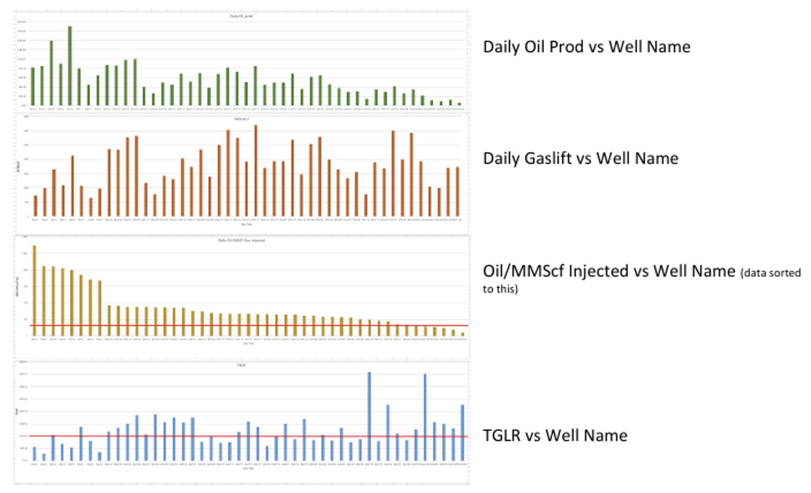

## Purpose
Maintain base production in an offshore waterflood field mainly produced by Gas Lift (GL) and ESP wells. Focused on low-Capex/Opex operations, avoiding well interventions. Iterative process led by Asset Development, executed with Production & Wellhead Maintenance teams.

## Tools
• OFM  
• Spotfire  
• Prosper  
• GAP  
• Excel

## Gas Lift (GL) Wells
• Analyze production efficiency via Excel/plots: oil rate vs. gas injected, GLR trends, cumulative performance.  
• Identify outliers (over-injected, slugging, low productivity index wells).  
• Use GAP simulations to reallocate gas lift and optimize field-wide efficiency.  
• Focus on borderline wells (between strong and weak producers).  
• Increase frequency of well testing; verify metering accuracy and watercut analysis.  
• Update Prosper & GAP models with corrected PVT, salinity, and lift performance data.  
• Track daily losses/trips and execute preventive maintenance.

## ESP Wells
• Steady producers, but monitor for gas locking (high amps, vibration, motor temp).  
• Adjust ESP speed or water injection to stabilize performance.  
• Evaluate high-rate, high-watercut ESPs for network bottlenecks.  
• Optimize operation by balancing ESPs and GL wells.

## Injection Management
• Build injector-centered patterns in OFM using streamline data (Eclipse/T-Nav).  
• Track daily/weekly/monthly IWR/VRR (injection-to-withdrawal ratios).  
• Adjust water injection rates to maintain VRR ≈ 1.  
• Continuously update patterns as wells are added/shut in.  
• Daily coordination with production teams on injection changes.

## Reviews
• Weekly Well Reviews (Spotfire): quick look at last 6 months performance; flag problematic wells.  
• Weekly Pattern Reviews (OFM): check oil rate, GOR, watercut, IWR/VRR; flag weak patterns for deep dive.  
• Each review session limited to 2 hours for focus.

## Facilities & Maintenance
• Monitor compressor performance, especially in hot weather.  
• Reduce gas lift usage or clean cooling fins to sustain discharge pressure.  
• Coordinate well and facilities maintenance via integrated planning team.  
• Optimize chemical injections (esp. demulsifiers).  
• Account for weather-related access limits to offshore jackets.

## Overall Goal
Maintain production efficiency and system reliability by optimizing gas lift allocation, ESP operations, injection balance, and facilities performance — all with minimal capital spending.

