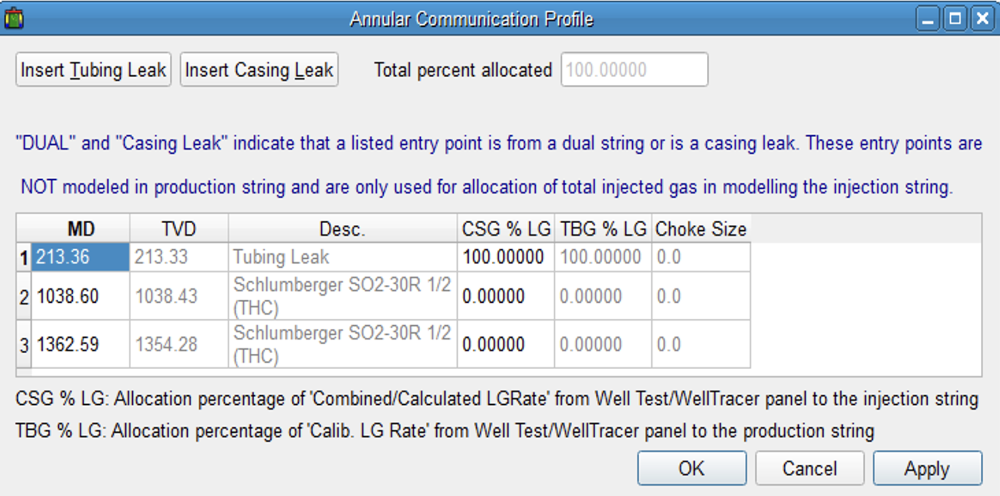

## Background
Well B was observed to be circulating gas following an acid job to remediate scale. The scale was thought to be Calcium Carbonate scale however since the reservoir was of carbonate origin Strontium Sulphate scale could have also been present. The well can inject 760 MSCF gas at 14 kg/cm2 Casing pressure and the Tubing pressure was 10.8 kg/cm2. Conventional analysis had indicated the leak point at approximately 213 mMd. Well Diagnostic and Optimization Suite of tools were utilised on Well B.

## Information
#### Table 1: Current Install Design

#### Table 2: WellTracer Travel Time Prediction

#### Figure 1: Pressure vs Depth Conventional Leak Analysis

#### Figure 2: Well B, Observed Co2 Returns

#### Table 3: Returns Analysis (SPM @1362 m Md)

#### Figure 3: Pressure vs Depth (well has inflow problems.)

## Summary
The WellTracer survey detected the injection point was from the SPM located @ 1362 mMd. The tubing had integrity above the injection point and that there was no leak @ 213 mMd, as determined by conventional analysis. The well is experiencing inflow problems either from the Iron oxide formed from the acid job or scale has broken off the tubing wall and has fallen into the wellbore causing inflow issues. The Welltracer survey also determined that the SPM located @ 1038 mMd, is possible plugged by scale.